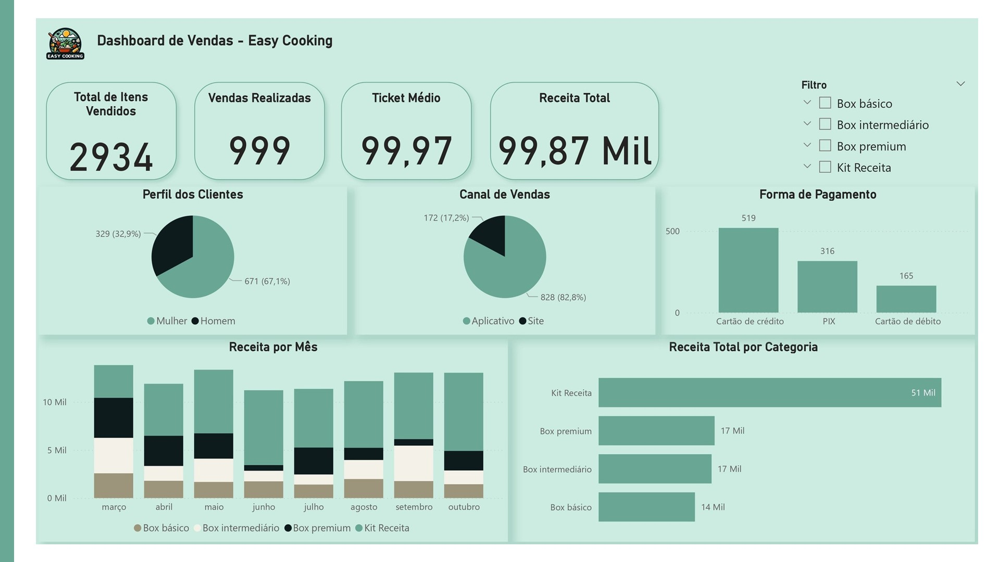

## Projeto Integrador

No primeiro semestre do CST em Ciência de Dados para Negócios, os alunos desenvolvem o Projeto Integrador, uma atividade prática que simula a criação de uma empresa. Nessa experiência, aplicam metodologias de inovação e estratégias de marketing, conectando teoria e prática para resolver desafios reais do mercado.

O Dashboard Geral da Easy Cooking integra dados de vendas e marketing, mostrando receita, produtos mais vendidos, perfil de clientes e canais preferidos, apoiando decisões estratégicas e operacionais.

O Dashboard de Marketing da Easy Cooking reúne informações importantes sobre os clientes, como perfil, avaliações e chances de compra. Também identifica clientes mais ativos, ajudando a empresa a melhorar campanhas e estratégias de retenção.

O Dashboard de Vendas da Easy Cooking fornece uma visão clara dos principais indicadores da empresa, como o total de clientes ativos,vendas realizadas, ticket médio e receita total. O cartão de crédito é a forma de pagamento mais utilizada. Além disso, o gráfico de receitas mostra que o Kit Receita é o item de maior faturamento. O dashboard facilita a análise dos resultados e a tomada de decisões estratégicas.

Licença do projeto: MIT: Uma licença permissiva que permite que qualquer pessoa use, modifique e distribua o código do seu projeto, sem restrições.